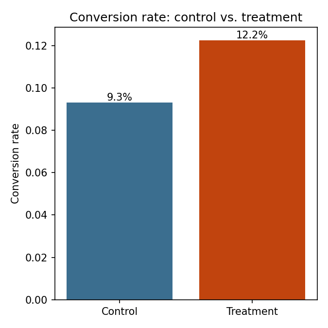

# A/B Test Analysis Report

Control: 2000 users  |  Treatment: 2000 users

Multiple-testing correction: **benjamini_hochberg** (alpha = 0.05)

## Summary

| Metric | Raw p-value | Adjusted p-value | Significant? | Effect size | Interpretation |
|---|---|---|---|---|---|
| Conversion rate | 0.0026 | 0.0039 | **Yes** | Cohen's h=0.095 | negligible |
| Revenue per user | 0.0022 | 0.0039 | **Yes** | Cohen's d=0.097 | negligible |
| Page load time (ms) | 0.4011 | 0.4011 | No | Cohen's d=0.027 | negligible |

## Conversion rate

**Test:** two-proportion z-test

- Control rate: 9.30%
- Treatment rate: 12.25%
- Absolute difference: 0.0295
- Relative lift: 31.72%
- 95% CI for difference: [0.0103, 0.0487]
- Raw p-value: 0.0026  |  Adjusted p-value: 0.0039
- Effect size (Cohen's h): 0.095 (negligible)
- Verdict: **Statistically significant** after benjamini_hochberg correction

## Revenue per user

**Test:** Welch's t-test

- Control mean: 2.410
- Treatment mean: 3.305
- Absolute difference: 0.8946
- Relative lift: 37.12%
- 95% CI for difference: [0.3216, 1.4677]
- Raw p-value: 0.0022  |  Adjusted p-value: 0.0039
- Effect size (Cohen's d): 0.097 (negligible)
- Verdict: **Statistically significant** after benjamini_hochberg correction

## Page load time (ms)

**Test:** Welch's t-test

- Control mean: 847.516
- Treatment mean: 850.704
- Absolute difference: 3.1877
- Relative lift: 0.38%
- 95% CI for difference: [-4.2542, 10.6297]
- Raw p-value: 0.4011  |  Adjusted p-value: 0.4011
- Effect size (Cohen's d): 0.027 (negligible)
- Verdict: Not statistically significant after benjamini_hochberg correction

## Power analysis: sample size for a future test

To reliably (power=0.8) detect a 10% relative lift on each metric's current baseline:

| Metric | Baseline | Required n per group |
|---|---|---|
| Conversion rate | 0.093 | 15,984 |
| Revenue per user | 2.410 | 19,242 |
| Page load time (ms) | 847.516 | 33 |
